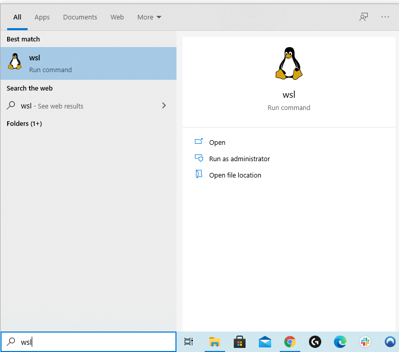
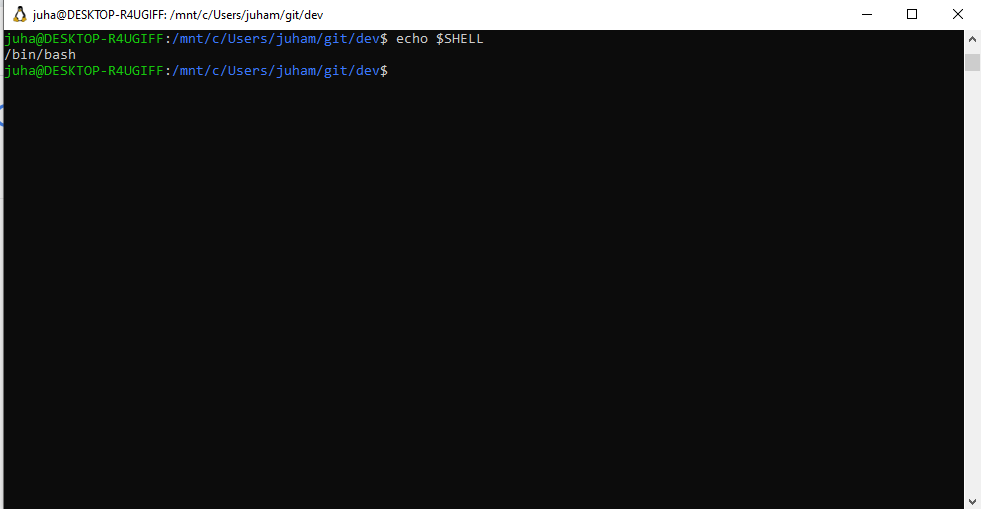

# Developing on Windows

## WSL

Let's have a look at [Windows Subsystem for Linux](https://docs.microsoft.com/en-us/windows/wsl/). A lot has happened since Microsoft CEO [called Linux cancer](https://www.zdnet.com/article/ballmer-i-may-have-called-linux-a-cancer-but-now-i-love-it/). Now Windows natively supports Linux inside it. And doesn't call it cancer, but a feature.

Good news is that WSL really works. It's snappy, lightweight and fun.

From a developers point of view main things you get from WSL are

* A proper shell. No longer `cmd`. Finally! No more PowerShell (I've never used that...).
* Editing code on Windows (VS code) and running it on Linux, see [Get started using Visual Studio Code with Windows Subsystem for Linu](https://docs.microsoft.com/en-us/windows/wsl/tutorials/wsl-vscode)

There are a few steps to get WSL up and running, but nothing funny there. Just follow th

### Shell

Starting shell is as easy as starting any Windows app:



And without delay you get a Bash prompt that is running on a Linux instance.



A cool feature is that the Windows file system is mounted, typically in `/mnt/c` allowing things like editing files using `vi` or `emacs`. The shell feels native, you couldn't tell there's another kernel running it. There is no strange behaviour e.g. when copy pasting text.

#### Windows Terminal

WSL is integrated with [Windows Terminal](https://docs.microsoft.com/en-us/windows/terminal/). Instead of using plain shell, you can using a fully fledged terminal app with tabs and split panes and have as many as you want Linux shells.

A small thing you'll want to do is to use your WSL shell as the default in WT. Open WT and do `CTRL+,`. You'll see something like:

```
"defaultProfile": "{61c54bbd-c2c6-5271-96e7-009a87ff44bf}",
```

In `profiles` -> `list` you should see your Linux profile. Copy-paste the guid of that one to the `defaultProfile` and restart WT.

### Developing using VS code

Things kind of work. The sad truth is that you can't do everything you could do with a full VM with this approach.

TODO: example

#

Imagine there was a maintained develope


