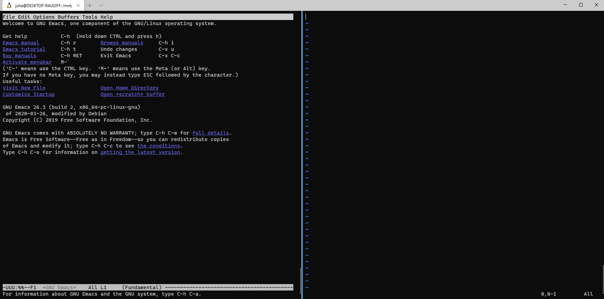
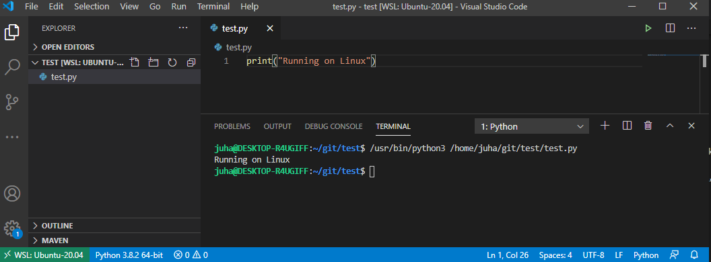

# Developing on Windows

Developers love the power of command line, nice package management. Basically, an Unix-like environment. Most developers nowadays prefer Mac and some (like me sometimes) Linux. However there are tons of reasons of buying a PC instead of a Mac, one very important being the pricing. When spending your own money you don't really want to pay the Apple tax. Also, if you happen to be a gamer, the odds are that you own a powerful Windows PC. Why buy a Mac just for development? Also, when you happen to have the PC, why install Linux on that just 

This document is about exploring the world of Windows as a development environment for somebody preferring nice things from Linux/Mac such as command line.

The good news is that Windows has evolved a lot lately to become a developer friendly (friendlier) OS.

Let's go and see what's the status nowadays.

## WSL

Let's have a look at [Windows Subsystem for Linux](https://docs.microsoft.com/en-us/windows/wsl/). A lot has happened since Microsoft CEO [called Linux cancer](https://www.zdnet.com/article/ballmer-i-may-have-called-linux-a-cancer-but-now-i-love-it/). Now Windows natively supports Linux inside it. And doesn't call it cancer, but a feature. First, what is WSL (2)?

> The Windows Subsystem for Linux lets developers run a GNU/Linux environment -- including most command-line tools, utilities, and applications -- directly on Windows, unmodified, without the overhead of a traditional virtual machine or dual-boot setup.

OK, sounds good but how does it work in practice? There are a few steps to get WSL up and running, but nothing funny there. Just follow the instructions and you'll be fine. Good news is that once you have it up and running I can tell that WSL really works and it's snappy, lightweight and fun. The experience is much smoother than anything I've ever seen using a VM on e.g. VirtualBox.

From a developers point of view the main things you get from WSL are:

* A proper shell. No longer `cmd`. Finally! No more PowerShell (I've never used that...).
* Editing code on Windows (VS code) and running it on Linux, see [Get started using Visual Studio Code with Windows Subsystem for Linu](https://docs.microsoft.com/en-us/windows/wsl/tutorials/wsl-vscode)

What you don't get is that your Windows doesn't become Linux. The key issues in my opinion:

* The shell you run on WSL, e.g. `bash` is really running on a Linux kernel. This means that you can't run Windows command line commands there, e.g. no running of `.bat`-scripts.
* There's no support for Linux GUI apps. You can't run your Linux-based favourite editor (if it has a GUI). Basically no running of VS Code or IntelliJ directly on Linux.
* WSL is a virtualized kernel, not a host running on metal. This means that you can't e.g. run VirtualBox on the WSL. From this point of view WSL is like an instance on any cloud provider. You can naturally run VirtualBox on Windows (that runs on metal), but in that case WSL and VMs inside VirtualBox are kind of siblings.

There are major and minor issues in the details when using WSL, let's see those next as we check out the main features.

### Shell

Starting a Linux shell is as easy as starting any Windows app:


And without delay you get a Bash prompt that is running on a Linux instance. Magic! OK, to tell the truth, there's gonna be a small delay the first time you fire up WSL, but after that it's going to be instantenious.


The shell feels native, you couldn't tell there's another kernel running it. There are no strange behaviours and annoyances, e.g copy-pasting just works. 

A cool feature is that the Windows file system is mounted, typically in `/mnt/c` allowing things like editing files on your Windows home directory using `vi` or `emacs`.  

### Windows Terminal

Although running a shell is simple, I'd recommend using [Windows Terminal](https://docs.microsoft.com/en-us/windows/terminal/) instead. It gives you more. WSL is integrated with Windows Terminal. WT is a fully fledged terminal app with tabs and split panes and you can have as many as you want Linux shells in it. This feels like running Terminal app on Ubuntu or iTerm2 on Mac. It's pretty cool that in WT you can mix and match WSL shells with Windows command prompt and PowerShell.

One minor complaint I have is that e.g. in Ubuntu terminal you can double-click a word and it gets selected. There's no such functionality as least by defeault.

A small thing you might want to do is to use your WSL shell as the default in WT. From the box it uses PowerShell. Open WT and do `CTRL+,`. You'll see something like:

```
"defaultProfile": "{61c54bbd-c2c6-5271-96e7-009a87ff44bf}",
```

In `profiles` -> `list` you should see your Linux profile. Copy-paste the guid of that one to the `defaultProfile` and restart WT. 

Like in any terminal app there are tons of knobs to turn to make it feel your own, have a look at the conf guide.

Here's what it looks like to run `emacs` and `vi` side by side. No need to end the editor war, you can run both :) And both on Linux on Windows. Piece :) Next we'll somehow mix macOS to the soup... 



### Developing using VS code

What is great in native apps is they are native. They will always be snappier, better integrated with the OS etc than anything running remotely. Because of this MS has developed a mechanism to run VS code on Windows (to make the IDE UI great), but to execute the code on WSL. Can this really work?

The good news is that that simple things really work. You can e.g. develop on Python and run on Linux:



This is pretty cool. VS Code will actually install the required plug-ins on WSL side and run them there.

### Issues

Some of the most typical issues with virtualization have always been performance related. In WSL case there are fundamental issues related to disk IO performance that are caused by the WSL architecture. The WSL instance (Ubuntu) has a WSL-local ext4 partition mounted to `/`. The Windows drive, typically C is mounted to `/mnt/c` as type [9p](https://en.wikipedia.org/wiki/9P_(protocol)). From Windows you can access the WSL disk e.g. by opening `\\wsl$` in Windows Explorer. Note that cross-using disk is over network, for both directions (from Windows to WSL and from WSL to Windows). Is this fast? Depends on the speed you need. When doing basic stuff like browsing file system (on shell or in Windows Explorer), you probably won't notice anything. But when doing something heavier the performance _can be_ intolerable. I tried having a largish Java project (Apache Flink) on the Windows drive and opening it up on VS Code (Windows native, using WSL remote). It took eternity to open it, at least half an hour. I'd assume this is at least 10 times slower than if everything (IDE and files) were local. I verified the same performance characteristics when compiling Maven. Very slow.

I didn't try more complex networking setup with e.g. bunch of Docker containers running on WSL and exposing TCP ports from those Windows. I'd assume there's going to be pain to get things nice and smooth. 

## Some notes on VirtualBox

The old-school / traditional / heavy approach of running Linux on Windows is to use a virtual machine inside e.g. VirtualBox.

To compare the user experience of using a VM to the WSL experience, I installed the same Ubuntu version in a VirtualBox VM and tried how it feels to run the VM with UI (Gnome). I tried installing IntelliJ on such a VM and testing how it feels to use it.

The sad truth is that the experience is not very good. Everything is slower than when using a native app (running on Windows). Just having the bootup delay is something that feels annoying after playing around with WSL.

It'd be a much much better user experience one could retire VB and use WSL instead.

### VirtualBox and WSL

It seems that VirtualBox (at least 6.1.X) and WSL 2 don't work simultaneously. If you try that [strange problems](https://askubuntu.com/questions/1239382/error-when-installing-ubuntu-20-04-in-virtualbox), probably a [VirtualBox](https://www.virtualbox.org/ticket/19766) arise. This is a very sad thing, since it prevents one from having a nice shell in Windows (WSL) and running a full fledged VM at the same time (VirtualBox). You have to select one of these and can't even change the selection withtout reboot :(  Hopefully this gets fixed.

This a very good example of problems that arise when using virtualization. The problems are impossible to prevent and next to impossible to debug. And this category of problems come and go, it's perfectly possible something works today but not in a year. As a developer I want to spend 0% of my time dealing with issues like this.

## Conclusions

WSL 2 is a very nice and welcome feature to Windows. It seems it has traction in Microsoft and will be improved in the future. It seems that even as it is now, it does provide a lot of value, e.g. by being able to run `bash` and work on command line. However, for many use cases, it just is not good enough e.g. because of the disk IO and the fact that you're limited to use only command line programs.  

VirtualBox.... What can I say. If you really need to run Linux desktop on Windows, you can use it. But honestly, the user experience is too sluggish. You don't want to use VB as your main development environment.


