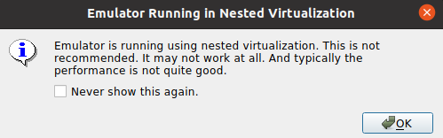

# Notes on using VirtualBox on Windows as development environment

This page contains some notes of using Ubuntu 20.04 on VirtualBox on Windows. I've been running this setup for a month+ and as a whole, I'm pretty happy with the setup. I can use "cheap" HW (read: not buy a Mac) and run fully-fledged Linux without using the cumbersome dual boot mechanism.

## Setup issues

There were some steps needed to get everything smootly running, e.g. making Ubuntu to properly support the native non-standard resolution of my monitor required non-obvious extra effort. One had to install the guest additions.

In any case, setting up everything takes time and effort. Just byuing a Mac would have saved all that time. So in a corporate environment, all this hassle doesn't probably pay off. But for anybody just owning a PC, I think this makes sense.

## Good stuff

The save state - start cycle is fast (enough), each step taking maybe 30 seconds. When I shutdown Windows, I don't shutdown the VM, I just freeze it. This is actually pretty cool, it lets me continue working from exactly where I left.

One can backup the whole VM. However, I haven't done this more than once. The issue is that taking backup is not in the natural path of save state - start cycle and requires extra effort. Thus, as a lazy human being, I just don't do it.

Performance has been good enough for the tasks I've been using the VM for.

It's pretty cool actually that I can give the VM less cores than the computer has. That way if I leave the VM e.g. to do a heavy build-test process of some application, I can meanwhile jump to Windows to do something else and the Windows side has an unused core, making it almost unaware of heavy compute happening on the physical computer. If the build/test was happening on e.g. the Windows side, I'm pretty sure all build process would hod all the CPU and make the OS slower.

## Issues

The screen refresh is not as snappy as on Windows, e.g. if you scroll in Chrome, the scrolling is not as smooth. This is not that bad I think, it's something that could be better, but doesn't bother me too much.

It's slightly annoying that the right CTRL is the hot key that one can use (CTRL-f) to escape the full screen VM. This means that you can't use right CTRL for anything else. The keyboard command coming from the spine sometimes use that key. Naturally I could map the hotkey to some other unused (is there such) key to circumvent the issue. 

When listening to music, I tend to use Spotify on Windows. After all, at any time, I might stop using the VM and continue with something not needed Linux on the Windows-side. I don't want to have the hassle of stopping Spotify on the VM and starting it again on Windows (and vice versa). Here the issue is that the play, stop etc keys on the keyboard don't work for Spotify since Ubuntu handles the signals. My Ubuntu is essentially silent, it never needs to emit any sounds. I haven't tried to fix this. Now if I want to change the song I need to exit the full screen VM and use Spotify on the Windows side.

In Android Studio, running an Android Virtual Device (AVD) greatly benefits of acceleration. The acceleration [restrictions](https://developer.android.com/studio/run/emulator-acceleration#vm-accel-restrictions) of AVD specifically state that "You can't run a VM-accelerated emulator inside another VM, such as a VM hosted by VirtualBox, VMWare, or Docker. You must run a VM-accelerated emulator directly on your host computer". In VirtualBox, however one can enable (running on a quite recent processor) "Enable Nested VT-x/AMD-V" to enable virtualization on the VM. This sounds like it would allow using acceleration in AVD, but if you do this and try to run an accelerated AVD:

## Open issues

The mousewheel doesn't work as well as it should. If you roll the wheel fast, it's likely the scrolling doesn't follow. So far I haven't been able to find out the reason. There are ideas out there what could be the issue, but the fixes haven't worked.

Sometimes, maybe even most of the times, after the VM has been resumed from the saved state, when I make it full screen, the screen looks like a mess, almost like white noise with strange horizontal lines. Repeating the exit full screen, enter full screen-cycle makes the full screen work eventually. There are similar display-related issues in Chrome. Sometimes the content section of Chrome gets corrupt, it might 50% just black or sometimes scrolling doesn't work.
